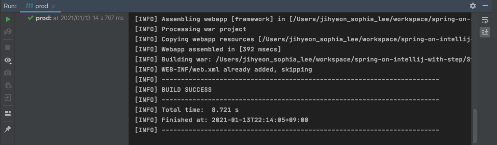

# 1강
## 1. intelliJ에서 tomcat 설정
1. Open - 첨부파일 내에 있는 pom.xml 선택 - Open as Project 선택
2. 오른쪽 상단 Edit Configuration -  왼쪽 + 버튼  - Tomcat - local 선택
3. Tomcat Home: Tomcat 설치된 경로 지정해주기(나의 경우 `/usr/local/Cellar/tomcat/9.0.40/libexec`)
4. 포트번호 지정(default: 8080 / oracle에서 쓰고 있을 가능성이 높으므로 `9090`으로 변경해줌)
5. 아래쪽 Warning - fix - `프로젝트명.war exploded` 선택
6. OK 눌러서 완료

## 2. 컴파일 시 java: error: release version 5 not supported 오류 해결방법
1. pom.xml 파일에
```xml
    <maven.compiler.source>1.8</maven.compiler.source>
    <maven.compiler.target>1.8</maven.compiler.target>
```
추가<br/>
2. 그래도 오류가 나네?
- Preferences - Compiler - Java Compiler에서 `Target bytecode version`을 1.8로 수정
  - Maven으로 빌드할 때 pom에 있는 정보를 참조하긴 하나 intelliJ로 빌드할 때는 프로그램에 설정되어 있는 정보로 빌드하기 때문에 빌드를 어떻게 하느냐에 따라 다를 수 있다.
  - File - Project Structure - language level도 체크

# 2강
## Maven 빌드하기
1. 프로젝트 import 후
2. Run - Edit Configuration
3. 좌측 상단 + 버튼 클릭 - Maven 선택
4. Name - `prod`, Command Line - `package`, Profiles - `prod` 입력해주기
5. Run 버튼 클릭<br/>
   
클릭했더니
- source option 5 is no longer supported. use 6 or later. 이런 오류가 났다.
  - 맥에서 maven을 brew로 설치하였을 때 발생하는 것으로 추정

- 해결방법: `pom.xml`에 `properties` 추가
  - 해결하고 보니 1강에서와 같은 오류였음.. 추후에 학원 수업 시간에서도 미리 설정해줘야 할 듯

```xml
 <properties>
        <project.build.sourceEncoding>UTF-8</project.build.sourceEncoding>
        <project.reporting.outputEncoding>UTF-8</project.reporting.outputEncoding>
        <!-- 추가 -->
        <maven.compiler.source>1.6</maven.compiler.source>
        <maven.compiler.target>1.6</maven.compiler.target>

        <spring.version>4.2.0.RELEASE</spring.version>
```

- properties 안에 추가해주고 나니 잘 됨.